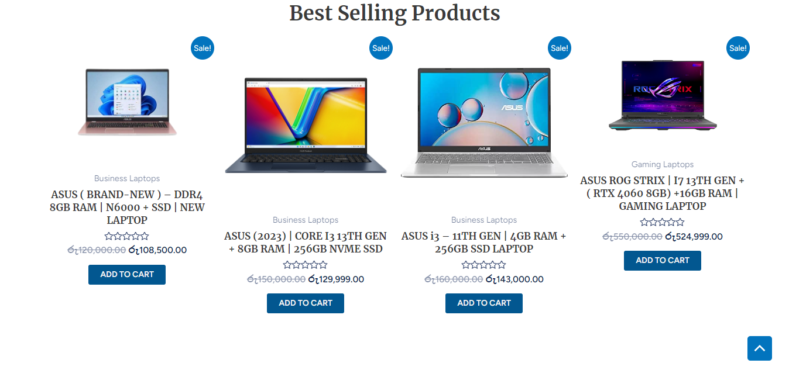
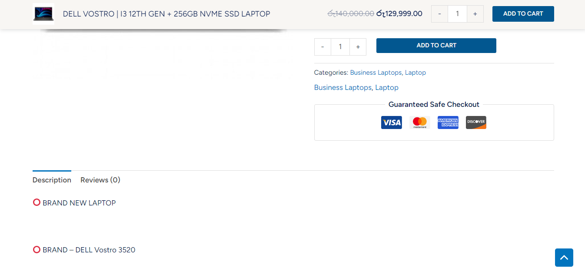

# Tech Ninja
## Table Of Content
- [Tech Ninja](#emmarket)
  - [Table Of Content](#table-of-content)
  - [Overview](#overview)
  - [Features](#features)
  - [Installation](#installation)
    - [Run](#run)
    - [Backend \& API](#backend--api)
  - [Usage](#usage)
    - [POS Page (home page)](#pos-page-home-page)
    - [Products Filteration and Searching](#products-filteration-and-searching)
    - [Change the display way](#change-the-display-way)
      - [Display as Cards](#display-as-cards)
      - [Display as List](#display-as-list)
    - [Carts \& Filterations \& Sorting](#carts--filterations--sorting)
    - [Single Cart Manpluation](#single-cart-manpluation)
    - [Category Page](#category-page)
    - [Unit of Measure Page](#unit-of-measure-page)
    - [Product Page](#product-page)
    - [Dashboard Page](#dashboard-page)
  - [Configuration](#configuration)
  - [APIs and SDKs](#apis-and-sdks)
  - [License](#license)

## Overview 
The web application is specifically designed for supermarkets to effectively manage their products and customer carts. It offers a range of features tailored to streamline supermarket operations. Key functionalities of the application include:

1. Product Management: The application allows supermarkets to easily manage their product .inventory, including adding new products, updating product details, and removing products when necessary.

2. Cart Management: Supermarkets can handle multiple customer carts concurrently, enabling efficient management of checkout processes for multiple customers at the same time.

3. Total Amount Calculation: The application provides the ability to calculate the total amount for each customer's cart, considering factors such as product prices, quantities, and any applicable discounts or taxes.

4. Cart Descriptions: Supermarkets can add descriptions to each cart, allowing cashiers or customers to provide additional details or notes for better organization and reference.

By utilizing this web application, supermarkets can streamline their product and cart management processes, enhance customer service, and ensure accurate calculation of order totals for a seamless shopping experience.

## Features
> Product Management
>
> Multi-Cart Management
> 
> Search & Filteration system
> 
> Category Manpluation page
> 
> Unit of measure Management
> 
> Dashbaord for Users
> 
> Authentication System
> 
> User Authorization 
>
> Switch Between Themes 

## Screenshots
Checkout the screenshots below for reference before installation :)

By incorporating these I have enhanced the functionality, state management, UI design, data fetching, data validation, navigation, and visual aspects of the project. These libraries contribute to an improved overall user experience and efficient development process.
## License

Tech-Ninja project is licensed under the [MIT License](LICENSE).
